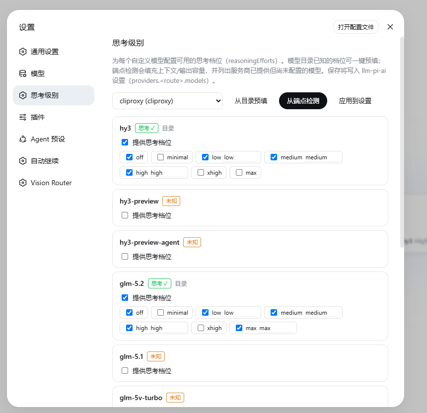

[English](README.md) | 简体中文

# dsh-reasoning-efforts

DSH 插件：为 `llm-pi-ai` 设置命名空间下的**自定义模型配置思考档位（`reasoningEfforts`）**，
在设置页面里编辑，不用再手改 `settings.yaml`。

> 解决的痛点：在 DSH 的模型页面添加自定义服务商 / 模型后，每个模型都要手动填
> `reasoningEfforts`。这个插件提供逐模型编辑器（档位一键勾选），外加两个辅助能力：
> 预填模型目录已知的档位；端点检测填充上下文 / 输出容量，并列出服务商已提供但
> 你尚未配置的模型。



## 工作原理

客户端半边是一个 Web 设置页，通过官方客户端通道（`ctx.connection.api`）驱动一切：
`settings.describe` / `llm.models` / `llm.discoverModels` / `settings.mutate`，
界面文案走官方 locale 服务（中英双语，跟随 DSH 界面语言）。
由于官方 `llm.discoverModels` 通道会在宿主侧剥掉推理信号（且名字命中 pi-ai 内置
目录的路由根本不会请求端点），宿主半边注册了一个同源路由 —— `GET
/thinking-levels/raw-models?route=<route>` —— 返回服务商的**原始** `/models` 列表
（存储的凭证在服务端解析，带 `/api` 同款浏览器信任围栏）。
「从端点检测」将两者互补合并：

- 原始端点信号（`supported_features`、`supported_parameters`、
  `supports_reasoning` 等）判定是否支持推理（高置信度）；
- pi-ai 目录（`llm.models`）细化提供的档位集合，端点没说时由目录补充（中置信度）；
- 两者都沉默 → 未知，由用户手动勾选。

插件面向**真实的** DSH `llm-pi-ai` 模型 schema：每个 `models[]` 条目接受
`reasoningEfforts`，键是 pi-ai 的档位（`off`、`minimal`、`low`、`medium`、`high`、
`xhigh`、`max`），值是发给服务商的线上拼写。详见
[`docs/integration.md`](docs/integration.md)。

### 卸载无残留

插件只会写入你明确应用的**原生** `llm-pi-ai` 字段（`reasoningEfforts`，以及检测
得到的 `contextWindow` / `maxTokens` / `name`）。卸载插件后这些设置依然有效 ——
dsh 本身会继续消费它们 —— 想清理的话直接编辑 `settings.yaml` 删除即可（包括插件
替你追加的模型条目）。插件从不修改 `cordis.yml`（`dsh plugin remove` 会移除其挂载
行），也不在其他任何地方存储数据。

## 构建

```bash
pnpm install
pnpm build      # -> dist/index.js (ESM)、dist/client.js (ModuleLoader 工厂)
pnpm typecheck  # 可选
pnpm test       # 构建 + 运行检测单元测试
```

## 安装（`dsh plugin` 方式）

DSH 插件用 `dsh plugin` 命令管理：它把包安装进目标 profile（通过 pnpm），声明了
`dsh.bundle` 的包会自动挂载为 profile 层。

**从本地仓库安装**（测试推荐）：

```bash
cd /path/to/dsh-reasoning-efforts   # 相对路径以调用目录为锚点
dsh plugin --profile web add link:.
```

或使用绝对路径：

```bash
dsh plugin --profile web add link:D:\AllCode\dsh\dsh-thinking-levels
```

**从 npm / tarball 安装：**

```bash
pnpm pack                        # -> dsh-reasoning-efforts-0.1.1.tgz
dsh plugin --profile web add ./dsh-reasoning-efforts-0.1.1.tgz
```

或直接：

```bash
dsh plugin --profile web add dsh-reasoning-efforts
```

`dsh plugin` 在 profile 目录（`$DSH_HOME/profiles/web`）运行 pnpm，然后对账
`dsh.profile.bundles` —— 包声明了 `dsh.bundle.patch: ./cordis.patch.yml`，因此
自动加入层叠，其 `insert:` 行挂载插件。**cordis.yml / profile 层插件的加载需要
重启（或 reload）DSH。**

## 卸载（无残留）

1. 从组合中移除 `dsh-reasoning-efforts` 行 / 在插件设置里卸载该包。
2. 可选：从 `settings.yaml` 的 `llm-pi-ai` 段删除不再需要的 `reasoningEfforts`
   行（插件只写你明确应用的内容 —— 从不自行修改 `cordis.yml` 或其他 DSH 文件）。
3. 不再需要的话，删除本目录下的 `dist/` / `node_modules/`。

插件从不自行修改 `cordis.yml`，也不在你指定写入的 `llm-pi-ai` 设置之外存储任何
东西，卸载后零残留。

## 目录结构

```
src/
  index.ts            宿主：raw-models 原始发现路由（同源、凭证服务端解析）
  client.tsx          客户端：基于官方通道的本地化 settings.section 界面
  shared/
    types.ts          共享的模型 / reasoningEfforts 类型
    detection.ts      原始列表检测 + 默认档位逻辑（纯函数、可测试）
cordis.patch.yml      DSH 组合挂载行
package.json          构建 + dsh 宿主/客户端声明
tsdown.config.ts      打包配置（ESM 宿主半边 + ModuleLoader 工厂客户端半边）
```
